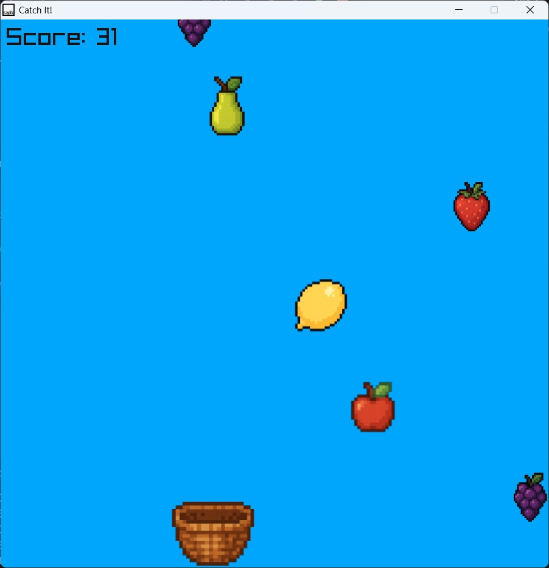

# Catch It Game- C++ with raylib
Simple "Catch It" game made in C++ using the raylib library.

# How to play the game
1. Press F5 on the keyboard to compile and run the program.
2. Use the left and right arrow keys to move the basket.

# Game preview

<!-- 

  

 -->

